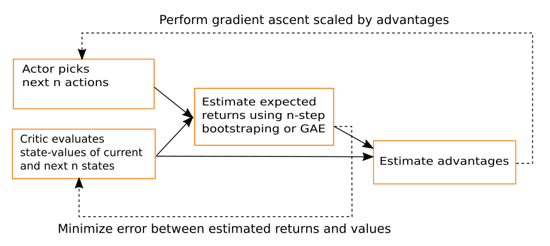
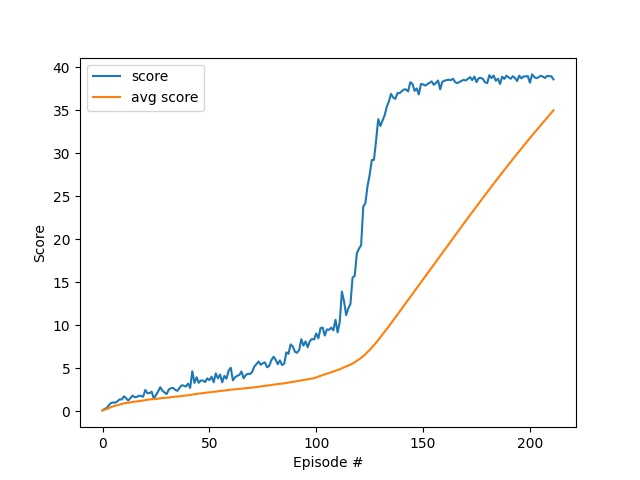
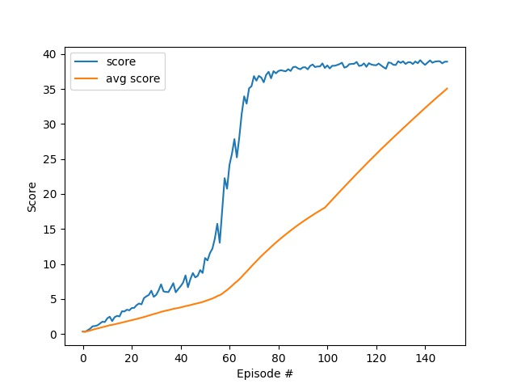

## Introduction
A2C with Generalized Advantage Estimation ([GAE](https://arxiv.org/abs/1506.02438)) is used to solve the Reacher problem with continuous control. The repository is structured as follows:

- `Continuous_Control.py`: This is the main python script for training and demonstrating the DQN algorithm

- `model.py`: The pytorch implementation of the Actor-Critic Network

- `a2c_agent`: The implementation of A2C agent with GAE

## Algorithm
### A2C
The A2C algorithm is a synchronous version of [A3C](https://arxiv.org/pdf/1602.01783.pdf), which is an Actor-Critic method. It utilized the followig techniques:

- __Baseline__: Compared to a basic Actor-Critic, where the critic estimates the Q-value, A2C uses the critic to estimate the advantage of the state-action pair. Since the advantage is defined as the difference between the Q-value and the state-value, the state-value serves as the baseline that reduces variance.
- __n-step bootstraping__: Instead of Monte-Carlo (low bias, high variance) and Temperal-Difference (high bias, low variance) estimates, A2C uses n-step bootstraping, which helps achieve a better trade-off between bias and variance. The idea is to let the agent interact with the environment n steps before estimating the expected return. This allows faster convergence with less experience required while keeping variance under control.
- __Parallel Training__: Since A2C is on-policy, a replay memory is not applicable as it must collect experience based its current policy. To address time-correlation within experience, A2C uses parallel training by running multiple instances of the environment and agent, which help trainging receive different states at the same time.

### GAE
GAE creates a exponentially-weighted mixture of all n-step bootstraping estimates while providing a hyperparameter lambda, which controls the weighting of each n-step estimate to the mixture, and thus the bias-variance trade-off. By taking into account different n-step estimates at once, the importance of choosing an ideal n is reduced.

For each step, A2C algorithm follows the below diagram:\


### Gaussian Actor
On top of the deterministic actor, a Gaussian distribution is added to the output of the actor network. A vector of of trainable standard deviations is used to parameterize the multivariate Gaussian distribution, which facilitates exploration in the beginning of training.

Hyperparameters:
- actor network
    - input: 33 units -> state size
    - fc1: 128 units (ReLU)
    - fc2: 128 units (ReLU)
    - fc3: 128 units (ReLU)
    - fc4: 4 units (Linear) -> action size
- gamma (discount factor): 0.95
- learning rate: 1e-4
- n_episodes: 300
- rollout memory length: 6 -> corresponds to 5-step bootstraping
- Gradient clipping: 5 -> used to clip the norm of gradient
- GAE tau: 0.5 -> the lever to control the weighting of each component

Note: It was found out that reducing gamma from 0.99 to 0.95 improves convergence significantly.

## Result
It turns out the A2C agent can perform better than the +30 score barrier, so the goal is set to be +35 over 100 episodes to show its potential.

The Reacher problem is solved without and with GAE

w/o GAE:
```
Total score (averaged over workers) for episode 212: 38.598499137256366
Environment solved in 212 episodes!     Average Score: 35.00
```


w/ GAE:
```
Total score (averaged over workers) for episode 150: 38.912999130226674
Environment solved in 150 episodes!     Average Score: 35.06
```


The experiments show that GAE accelerates the training significantly

## Future Work
- __PPO__: Train the actor using PPO so that same experience can be utilized more than once
- __Weight Sharing__: Try out weights sharing between actor and critic
- __DDPG__: Try out DDPG as an alternative approach and compare the performance